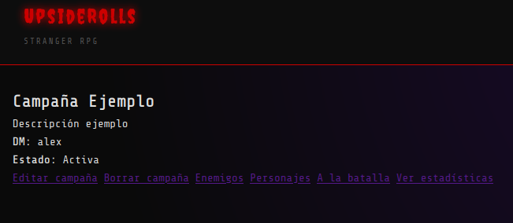
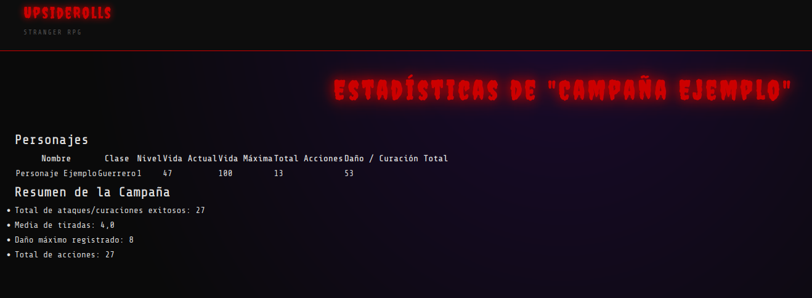

# UpsideRolls: StrangerRPG Documentación

Os presentamos UpsideRolls: StrangerRPG. Un juego de rol donde un Director de Campaña (DM) guía la historia y los jugadores crean personajes para participar en aventuras. Permite crear campañas, gestionar personajes y enemigos, y simular combates usando dados virtuales. La aplicación registra todas las acciones y genera estadísticas de la partida.

## Instalación
**No usar ninguna de las credenciales de ejemplo**


### Paso 1 - Revisar la instalación de Docker en tu sistema
```
docker --version
docker compose version
```

### Paso 2 - Creamos un archivo .env para nuestras variables de entorno

```
DJANGO_SUPERUSER_NAME=admin
DJANGO_SUPERUSER_EMAIL=admin@example.com
DJANGO_SUPERUSER_PASSWORD=admin123

POSTGRES_DB=db_ejemplo
POSTGRES_USER=usuario_ejemplo
POSTGRES_PASSWORD=1234

DB_NAME=db_ejemplo
DB_USER=usuario_ejemplo
DB_PASSWORD=1234
DB_HOST=db
DB_PORT=5432
SECRET_KEY=clave_secreta
DEBUG=True
```

### Paso 4 - Construir y levantar los contenedores
```
docker compose up --build -d
```

### Paso 5 - Acceder a la aplicación
```
http://localhost:8000
```

## Vamos, pruebalo por ti mismo!

Ya que te has interesado lo suficiente como para llegar hasta aquí vamos a hacer una pequeña guía para que entiendas cómo funciona la aplicación, como usuario DM, Quien tiene acceso a crear, editar y eliminar campañas.

Primero, al ingresar al enlace desde tu navegador, encontrarás la pantalla de inicio de sesión.


Seguramente ya estás familiarizado con esta dinámica.
Si ya tienes una cuenta, simplemente inicia sesión con tus datos.
Si no la tienes, haz clic en **“Registro”** (arriba a la derecha) o en **“Regístrate”** justo debajo del botón de **“Entrar”**.

Supongamos que somos completamente nuevos.


Procedemos a rellenar los campos que nos solicita el formulario y pulsamos en **“Unirse”**.

¡Y ya estaría! Ya tenemos la cuenta creada. La aplicación nos redirigirá directamente a nuestra página principal.


Aquí veremos que todavía no tenemos ninguna campaña creada, así que, ¿a qué esperamos? ¡Vamos a crear una!


Rellenamos los campos que nos pide.



Ahora que ya la tenemos creada, podemos ir a la Batalla, así que hacemos clic ahí.


Oh, espera. No tenemos ningún personaje ni ningún enemigo creado para nuestro juego.

Vamos a volver al menú para solucionarlo.

Hacemos clic en **Personajes**, luego **Crear Personaje** y aparecerá la pantalla de creación.

Rellenamos los campos. POdemos elegir entre diferentes opciones, como la vida, la clase, etc.


Con nuestro personaje listo, ahora sí, vamos a crear el enemigo.

Rellenamos los campos y lo creamos.


¡Ahora sí que sí! Vamos a la batalla.

La dinámica es sencilla.

Lo primero que debemos saber es que tenemos dos tipos de acción:
- Curarnos a nosotros mismos.
- Atacar al enemigo.

Si decidimos atacar, podremos:
- Seleccionar el enemigo que queramos.
- Elegir qué tipo de dados usar.
- Escoger el modificador.


Al hacer clic en **Ejecutar**, los dados se lanzarán y determinarán el daño que hacemos al enemigo.
El turno del enemigo se ejecutará al mismo tiempo que el nuestro.

Si optamos por curarnos, podremos recuperar vida según el resultado de los dados.
Eso si, el enemigo también podrá atacarnos durante esa misma tirada.


En la parte inferior de la pantalla tenemos el **historial de combate**, donde quedará registrado todo lo que ha sucedido durante nuestra campaña.


Cuando derrotamos a todos los enemigos, recibiremos una pantalla indicando que han sido eliminados, marcando así el final de la campaña.


Por último, puedes mirar las estadísticas de tu campaña clickando en **Ver estadísticas**. Aparecerá la siguiente pantalla



Y hasta aquí la guía.Espero que te haya gustado y que disfrutes tu aventura.


## Documentación del codigo

### Aplicación ``` accounts ```

### Usuario personalizado ```models.py```

Se implementa un modelo ```CustomUser``` extendiendo ```Abstractuser``` 

- **Email único** 

    El campo ```email``` se redifine como único y obligatorio.
    Esto permite:
    - Evitar duplicidades
    - Garantizar identificadores de contactos válidos

**Gestión de roles mediante grupos**

En lugar de crear un campo “rol” manual en el modelo, se utilizan los grupos de Django:

- Grupo DM
- Grupo PLAYER

Esto permite:
- Integrarse con el sistema de permisos nativo.
- Mantener coherencia con la arquitectura de Django.
- Facilitar la escalabilidad (posibles nuevos roles).

### Personalización del panel de administración  ```admin.py```

Se ha personalizado el panel de administración de Django para el modelo ```CustomUser``` mediante la extensión de ```UserAdmin```.

El objetivo  de esta configuración es:
- Facilitar la gestión de usuarios y roles.
- Mejorar la visualización de información relevante.

#### Visualización optimizada
Se definen los siguientes elementos:
- ```list_display```: muestra username, email y estado del usuario.
- ```search_fields```: permite búsqueda rápida por nombre o email.
- ```list_filter```: habilita filtrado por estado, permisos, grupos y fechas.
- ```ordering```: orden alfabético por nombre de usuario.
- ```list_per_page```: limita la paginación para mejorar legibilidad.

Los campos se agrupan las siguientes secciones:
- Información personal
- Permisos
- Fechas importantes

#### Creación de usuarios

Se define un ```add_fieldsets``` personalizado para simplificar la creación de nuevos usuarios desde el panel administrativo.

#### Formulario de registro ```forms.py```

Para la creación de nuevos usuarios se implementa un formulario personalizado basado en ```UserCreationForm```.

Se extiende ```UserCreationForm``` en lugar de crear un formulario desde cero porque incluye validaciones seguras de contraseñas y reduce complejidad y posibles errores de seguridad.
- El campo ```email``` se redefine como obligatorio en el formulario.

### Vistas de registro y login `views.py`

`def registro(request)` | <small> `registro/`</small>

**Función:** Gestiona el registro de nuevos usuarios.

**Parámetros:**

- `request`: HttpRequest con datos del formulario.

**Devuelve:** Formulario renderizado o redirección tras registro exitoso.


`def login_view(request)` | <small> `login/`</small>

**Función:** Autentica usuarios existentes.

**Parámetros:**
- `request`: HttpRequest con credenciales.

**Devuelve:** Formulario de login o redirección.


`def logout_view(request)` | <small> `logout/`</small>

**Función:** Cierra la sesión activa.

**Parámetros:**

- `request`: HttpRequest actual.

**Devuelve:** Redirección a la vista de autenticación.
campaña
### Creación de grupos `crear_grupos.py`

`Command(BaseCommand)`

Configura los grupos de usuarios **DM** y **PLAYER** con los permisos necesarios sobre los modelos del juego.

- `DM` – Grupo de directores de campaña.
- `PLAYER` – Grupo de jugadores normales.

- **Permisos asignados:**

  - **DM:** Acceso a `Campana`, `Enemigo` y `RegistroAccion`. Esto permite:
    - Crear, editar y eliminar campañas y enemigos.
    - Registrar acciones de combate.

  * **PLAYER:** Acceso a `Personaje`, `RegistroAccion` y `Campana`. Esto permite:
    - Gestionar sus personajes.
    - Registrar acciones propias en las campañas donde participa.
    - Consultar información básica de la campaña.

-  `def handle(*args, **kwargs)`
  - Usa `Group.objects.get_or_create` para crear los grupos si no existen.
  - Filtra los permisos por `ContentType` para cada modelo relevante.
  - Asigna los permisos a cada grupo con `group.permissions.set()`.
  - Imprime un mensaje de éxito.

---
### Aplicación `game`

### Modelado del dominio RPG `models.py`

#### Perfil de jugador `PerfilJugador`

Se implementa un modelo `PerfilJugador` vinculado mediante relación OneToOne con el usuario. Permite acceso directo desde `user.perfil_jugador`

Este enfoque permite extender la información del usuario sin modificar el modelo de autenticación.

Con esto conseguimos:
- Separar datos de autenticación de datos de juego
- Mantener modularidad y escalabilidad.


#### Gestión de campañas `Campaña`

Representa una partida dirigida por un DM, con varios estados y formada por múltiples jugadores.
- El control de estado se e define un campo `estado` con `choices`:
    - activa
    - pausada
    - finalizada

Esta relacionado con:
- **DM (director)**
  - `ForeignKey` al usuario.
  - `on_delete=PROTECT`: impide eliminar un DM con campañas activas.

- **Jugador**
  - `ManyToManyField` con usuario.
  - Permite múltiples jugadores por campaña.

#### Personajes `Personaje`

Es una entidad jugable asociada a un usuario dentro de una campaña.

Se relacionad de la siguiente forma:
- `propietario` - Usuario (`CASCADE`)
- `campana` - Campaña (`CASCADE`)

Si se elimina la campaña o el usuario, el personaje desaparece automáticamente.

Le introducimos una restricción de unicidad a traves de  ```unique_together = ('nombre', 'campana')```
Evita personajes duplicados dentro de la misma campaña.

Validamos mediante el método `clean()` que:
- `vida_actual` no supere `vida_maxima`.


#### Enemigos `Enemigo`

Entidad enemiga que está asociada a una campaña.

Su relación es:
- `ForeignKey` a campaña (`CASCADE`).

Al igual que con `Personaje`, tiene restricción de unicidad: `unique_together = ('nombre', 'campana')`


#### Registro de acciones `RegistroAccion`

Modelo encargado de almacenar el historial de acciones realizadas en una campaña.

Es el núcleo dinámico del sistema.

En sus relaciones podemos observar una diferencia clave entre ellas:
- `campana` es obligatoria
- `usuario`, `personaje`, `enemigo` son opcionales (`SET_NULL`). Esto permite conservar el historial incluso si se eliminan entidades relacionadas

 Control de tipos mediante `choices`
- `TIPOS_ACCION`
- `TIPO_DADO_CHOICES`

Se incorporan campos derivados como `total`, `exito`, `dano_curacion`, etc. Sirven almacenar el resultados en las acciones, facilitando la trazabilidad.


### Personalización del panel de administración `admin.py`

Aqui se configura el panel de administración para facilitar la gestión interna de campañas, personajes y acciones del sistema RPG.

**`PerfilJugadorAdmin`**

- `list_display` y `search_fields` configurados para permitir búsqueda por nombre de usuario mediante lookup relacional (`usuario__username`).

**`CampanaAdmin`**

- Configuración estándar de listado, filtros y búsqueda.
- `filter_horizontal` aplicado al `ManyToManyField` de jugadores para mejorar la gestión visual.
- `readonly_fields` en `fecha_creacion` para preservar integridad del dato automático.


**`PersonajeAdmin`**

- Configuración estandar de listado y filtros.
- `list_editable = ['vida_actual']` permite modificar puntos de vida directamente desde la vista de lista.


**`EnemigoAdmin`**

Tiene configuración estándar orientada a filtrado por campaña, tipo y dificultad.

**`RegistroAccionAdmin`**

- Configuración de listado y filtros enfocada a análisis.
- `date_hierarchy = 'fecha'` permite navegación cronológica por registros.

Se prioriza la consulta histórica y segmentación temporal.

**`RegistroAccionInline`**
- Orden descendente por fecha.
- `extra = 0` para evitar formularios vacíos innecesarios.

Permite consultar acciones relacionadas sin abandonar el modelo principal.


### Formularios avanzados `forms.py`

`PerfilJugadorForm`
Asociado al modelo `PerfilJugador`, impide la creación de perfiles asociados a terceros.
- Se recibe el usuario por parámetro `user`.
- `clean_usuario()` garantiza que el perfil siempre esté vinculado al usuario autenticado.

`CampanaForm`

Formulario para creación y edición de campañas.
- El usuario autenticado se asigna como `dm` automáticamente.
- `clean_dm()` impide que un usuario se asigne como DM distinto.
- `clean()` impide editar campañas dirigidas por otro DM.

`PersonajeForm`

Formulario para la creación de personaje
- `clean_vida_actual()` garantiza que la vida actual no supere vida máxima.
- `clean_nivel()` garantiza que el nivel esté restringido entre 1 y 20.
- `clean()` garantiza que el nombre del personaje sea único dentro de la campaña y previene duplicados dentro de la misma campaña.

`EnemigoForm`

Formulario de creación de enemigos vinculado a una campaña concreta.
- La campaña se recibe por parámetro y se oculta.
- Validación de unicidad de nombre dentro de la campaña.


`RegistroAccionForm`

Este formulario adapta su comportamiento según el usuario y la campaña

- Si el usuario pertenece al grupo **DM**, puede seleccionar enemigos.
- Si es **PLAYER**, debe seleccionar personaje obligatorio.
- `clean_campana()` Valida que el usuario pueda registrar acciones en esa campaña.
- `clean()` Principialmente verifica que exista campaña. Comprueba que personaje/enemigo pertenezcan a la campaña y que el resultado del dado esté dentro del rango permitido 


### `mixins.py`

`class SoloPropietarioMixin(UserPassesTestMixin)`

**Función:** Permite acceso solo al propietario del objeto.

- `test_func()` comprueba que `obj.propietario == request.user`.
- Si no se cumple, lanza `PermissionDenied`.

`SoloDMMixin(UserPassesTestMixin)`

**Función:** Restringe el acceso únicamente al Director de la campaña.

- `test_func()` verifica que el usuario sea el `dm`.
- Se usa para acciones exclusivas del director.


### Vistas de game `views.py`

`class CampanaView` | <small> `/`</small>

**Función:** Muestra la campaña activa.

- `get_context_data()` Añadimos la campaña actual al contexto del template.

**Devuelve:** Template con la campaña activa.

`class CampanaCreateView` | <small> `crear/`</small>

**Función:** Crea una nueva campaña.

- `dispatch()` Esto impìde crear más de una campaña antes de procesar la petición.
- `get_success_url()` Define la redirección tras creación exitosa.

**Devuelve:** Formulario o redirección.

`class CampanaUpdateView` | <small> `editar/`</small>

**Función:** Edita la campaña activa (solo DM).

- `get_object()` Siempre devuelve la primera campaña existente.
- `get_success_url()` Define redirección tras actualización.

**Devuelve:** Formulario o redirección.

`class CampanaDeleteView` | <small> `borrar/`</small>

**Función:** Elimina la campaña activa (solo DM).

- Se implementa `get_object()` y `get_success_url()` 

**Devuelve:** Confirmación o redirección.

`class PersonajeListView` | <small> `personajes/`</small>

**Función:** Lista personajes de la campaña activa.

- `get_queryset()`: Filtra personajes según la campaña actual.

**Devuelve:** Listado de personajes.

`class PersonajeCreateView` | <small> `personaje/crear/`</small>

**Función:** Crea un personaje asociado al usuario y a la campaña.

- Aqui tambien se implementa`dispatch()` y `get_success_url()`
- `form_valid()`: Asigna automáticamente propietario y campaña antes de guardar.

**Devuelve:** Formulario o redirección.

`class PersonajeUpdateView` | <small> `personaje/<int:pk>/editar/`</small>

**Función:** Edita un personaje (solo propietario).

- Se implementa `get_success_url()`

**Devuelve:** Formulario o redirección.

`class PersonajeDeleteView` | <small> `personaje/<int:pk>/borrar/`</small>

**Función:** Elimina un personaje (solo propietario).

* `success_url` definido directamente (no sobrescribe método).

**Devuelve:** Confirmación o redirección.


`class EnemigoListView` | <small>`enemigos/`</small>

**Función:** Lista enemigos de la campaña (solo DM).

- `get_queryset()`: Filtra enemigos según campaña activa.

**Devuelve:** Listado de enemigos.

`class EnemigoCreateView` | <small>`enemigos/crear/`</small>

**Función:** Crea enemigo asociado a la campaña.

- `get_form_kwargs()`: Inyecta la campaña al formulario.
- `get_success_url()` 

**Devuelve:** Formulario o redirección.

`class EnemigoUpdateView` | <small>`enemigo/<int:pk>/editar/`</small>

**Función:** Edita enemigo (solo DM).

- `get_form_kwargs()`: Reinyecta la campaña.
- `get_success_url()`

**Devuelve:** Formulario o redirección.

`class EnemigoDeleteView` | <small>`enemigo/<int:pk>/borrar/` </small>

**Función:** Elimina enemigo (solo DM).

- `success_url` definido directamente.

**Devuelve:** Confirmación o redirección.

`def batalla_view(request)` | <small>  `batalla/`</small>

**Función:** Gestiona la lógica del combate por turnos.

- Controla estado de batalla (activa, victoria, derrota).
- Gestiona turnos de enemigos y personajes.
- Genera tiradas aleatorias.
- Aplica daño o curación.
- Registra acciones en historial.
- Actualiza estado de turno en campaña.

**Devuelve:** Vista de batalla, victoria, derrota o redirección tras acción.


### Middleware de la aplicación `middleware.py`

`RegistroAccesoCampanaMiddleware`

Registra accesos de usuarios autenticados a vistas relacionadas con campañas.

- `call()`:
    - Guarda el tiempo de inicio de la petición.
    - Llama a la vista correspondiente (`get_response`).
    - Si el usuario está autenticado:
      - Obtiene el nombre de la ruta actual, 
      - Recupera la campaña de la URL si existe `pk`.
      - Calcula tiempo de respuesta en milisegundos.
      - Lo imprime
    - Captura excepciones para que no rompan la petición.

### Estadisticas (Consultas ORM) `analytics.py`

**`StatsCampanaView`** | <small>`<int:pk>/stats/`</small>

Vista basada en `TemplateView` que genera estadísticas completas de una campaña usando agregaciones y anotaciones avanzadas del ORM.

Para optimizar las consultas se utilizan:
- `select_related('dm')` evita consultas extra para el director.
- `prefetch_related(...)` precarga jugadores, personajes y registros.

Esto ayuda a que se reduzca el número de queries y optimice el rendimiento.


**Estadísticas por personaje con `annotate`**

Cada personaje de la campaña incluye:

- `total_acciones`: número total de acciones. Se usa `Count`
- `dano_total`: suma de daño en ataques. Se usa `Sum`
- `curacion_total`:  suma de curación. Se usa `Sum`

Se filtran las condiciones con `Q`

Esto genera métricas individuales por personaje.


**Estadísticas globales con `aggregate`**

Sobre todos los registros de la campaña:

- Total de acciones. `Count`
- Media de tiradas. `Avg`
- Daño máximo registrado. `Sum`
- Daño total. `Sum`
- Curación total. `Sum`

A la hora de filtrar, se construye una queryset que:
- Filtra solo ataques y curaciones.
- Solo acciones exitosas.
- Permite búsqueda opcional por nombre (personaje o enemigo).
- Usa `select_related`, lo cual optimiza relaciones.


## Dependencias

- **Django 6.0.2** – Framework web principal.
- **asgiref 3.11.1** – Soporte ASGI para Django.
- **psycopg2-binary 2.9.11** – Conector para PostgreSQL.
- **python-dotenv 1.2.1** – Manejo de variables de entorno.
- **sqlparse 0.5.5** – Procesamiento de consultas SQL.


## Workflow del proyecto

### Fase 1 - Inicialización y configuración del proyecto
- Creación del proyecto Django y estructura inicial de aplicaciones.
- Configuración de variables de entorno y conexión a PostgreSQL.
- Implementación de Dockerfile y docker-compose con servicio web y base de datos.
- Actualización del README inicial con instrucciones básicas de ejecución.

### Fase 2 - Usuario personalizado y autenticación
- Implementación del modelo de usuario personalizado y configuración en `settings.py`.
- Creación de vistas de:
  - Registro
  - Inicio de sesión
  - Cierre de sesión

### Fase 3 — Modelado principal del sistema
- Implementación de los modelos:
  - Perfil de jugador (OneToOne con Usuario)
  - Campaña
  - Personaje
  - Enemigo
  - Registro de acción/tirada
- Definición de relaciones:
  - `ForeignKey`
  - `OneToOne`
  - `ManyToMany` con `related_name` y `related_query_name`
- Definición de restricciones de unicidad y comportamiento coherente de `on_delete`.
- Generación y aplicación de migraciones iniciales.
- Creación de los grupos **DM** y **PLAYER** con asignación de permisos básicos.

### Fase 4 — Uso avanzado del ORM (Consultas)
- Uso de `Q objects` para filtrado complejo de registros.
- Uso de `F expressions` para actualización segura de vida en base de datos.
- Implementación de estadísticas.

### Fase 5 – CRUD principal mediante Class-Based Views
- CRUD completo de campañas con control de acceso por rol.
- CRUD completo de personajes con restricción por propietario.
- Aplicación de mixins integrados:
  - `LoginRequiredMixin`
  - `PermissionRequiredMixin`
- Creación de un mixin personalizado para restringir edición al propietario.

### Fase 6 — Lógica de juego y validaciones avanzadas
- Implementación del sistema de tiradas de dados y ejecución de acciones (ataque y curación) mediante Function-Based Views, con registro automático en el historial.
- Implementación de validaciones avanzadas en formularios:
  - Vida actual no superior a vida máxima.
  - Validación de nivel.
  - Comprobación de pertenencia a campaña.
  - Campos dinámicos según rol.

### Fase 7 — Optimización de consultas
- Aplicación de `select_related` y `prefetch_related` en vistas con relaciones múltiples para mejorar el rendimiento.

### Fase 8 – Middleware
- Creación de un middleware personalizado para registrar accesos a campañas.
- Documentación del comportamiento del middleware y su finalidad.

### Fase final — Documentación y cierre del proyecto
- Finalización del README incluyendo:
  - Explicación del workflow utilizado.
  - Mapa de trazabilidad con requisitos.
  - Documentación completa del proyecto.


## Mapa de trazabilidad

Se divide en requisitos funcionales(RF), que indican qué debe hacer el sistema, y no funcionales (RNF), especifican cómo debe comportarse o las restricciones que debe cumplir.

**RF1**

- **Requisito:** Registro y login de usuario
- **Archivo/Módulo:** `accounts/models.py`, `accounts/forms.py`, `accounts/views.py`
- **Evidencia:** `CustomUser`, `UserCreationForm`, `registro(request)`, `login_view(request)`; email único obligatorio y redirección tras registro.
- Fase 2 – Usuario personalizado y autenticación

**RF2**

- **Requisito:** Gestión de roles DM / PLAYER
- **Archivo/Módulo:** `accounts/crear_grupos.py`
- Fase 3 – Modelado principal del sistema

**RF3**

- **Requisito:** CRUD de campañas
- **Archivo/Módulo:** `game/views.py`, `game/forms.py`, `game/models.py`
- Fase 5 – CRUD principal mediante Class-Based Views

**RF4**

- **Requisito:** CRUD de personajes
- **Archivo/Módulo:** `game/views.py`, `game/forms.py`, `game/models.py`
- Fase 5 – CRUD principal mediante Class-Based Views

**RF5**

- **Requisito:** CRUD de enemigos
- **Archivo/Módulo:** `game/views.py`, `game/forms.py`, `game/models.py`
- Fase 5 – CRUD principal mediante Class-Based Views

**RF6**

- **Requisito:** Lógica de combate (ataque y curación)
- **Archivo/Módulo:** `game/views.py`, `game/forms.py`, `game/models.py`
- Fase 6 – Lógica de juego y validaciones avanzadas

**RF7**

 **Requisito:** Visualización de estadísticas
- **Archivo/Módulo:** `game/analytics.py`
- Fase 4 – Uso avanzado del ORM (Consultas) / Fase 7 – Optimización de consultas

**RF8**

- **Requisito:** Sesiones y cookies de juego
- **Archivo/Módulo:** `game/views.py`, templates
- Parte de cookies no realizada.
- Fase 6 – Lógica de juego y validaciones avanzadas

**RNF1**

- **Requisito:** Middleware propio y configuración
- **Archivo/Módulo:** `game/middleware.py`, `config/settings.py`
- Fase 8 – Middleware

**RNF2**

* **Requisito:** Mixins propios y de Django
* **Archivo/Módulo:** `game/mixins.py`
- Fase 5 – CRUD principal mediante Class-Based Views

**RNF3**

- **Requisito:** Relacionalidad y validaciones del ORM
- **Archivo/Módulo:** `game/models.py`, `game/forms.py`
- Fase 3 – Modelado principal del sistema / Fase 6 – Lógica de juego y validaciones avanzadas

**RNF4**

- **Requisito:** Entorno Docker + PostgreSQL operativo
- **Archivo/Módulo:** `docker-compose.yml`, `.env`
- Fase 1 – Inicialización y configuración del proyecto

## Estructura del proyecto
```
accounts
├─ management
│  └─ commands
│     ├─ __init__.py
│     ├─ crear_grupos.py
│     └─ init_.py
├─ static/accounts
│  ├─ css
│  │  └─ styles.css
│  └─ img
│     └─ logo_icon.jpeg
├─ templates/accounts
│  ├─ login.html
│  ├─ registro.html
│  └─ base.html
├─ __init__.py
├─ admin.py
├─ apps.py
├─ forms.py
├─ models.py
├─ tests.py
├─ urls.py
└─ views.py

config
├─ __init__.py
├─ asgi.py
├─ settings.py
├─ urls.py
└─ wsgi.py

docs/img
├─ atacar-enemigo.png
├─ campana-creacion.png
├─ campana-ejemplo.png
├─ campana-no-pj.png
├─ curarse.png
├─ Enemigo-Ejemplo.png
├─ historial-combate.png
├─ inicio-login.png
├─ no-campana.png
├─ Personaje-Ejemplo.png
├─ registro.png
├─ stats.png
└─ victoria.png

game
├─ static/game/css
│  └─ styles.css
├─ templates/game
│  ├─ batalla.html
│  ├─ campana_confirm_delete.html
│  ├─ campana_form.html
│  ├─ campana.html
│  ├─ crear_campana.html
│  ├─ crear_personaje.html
│  ├─ derrota.html
│  ├─ enemigo_confirm_delete.html
│  ├─ enemigo_form.html
│  ├─ enemigo_list.html
│  ├─ personaje_confirm_delete.html
│  ├─ personaje_form.html
│  ├─ personaje_list.html
│  ├─ stats.html
│  └─ victoria.html
├─ __init__.py
├─ admin.py
├─ analytics.py
├─ apps.py
├─ forms.py
├─ middleware.py
├─ mixins.py
├─ models.py
├─ tests.py
├─ urls.py
└─ views.py

Raíz del proyecto
├─ .gitignore
├─ docker-compose.yml
├─ Dockerfile
├─ manage.py
├─ README.md
└─ requirements.txt
```
